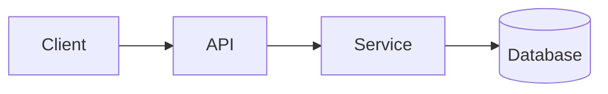

# Architecture: <Name>

**Status:** Draft | Approved | Implemented
**Author:** <name>
**Date:** YYYY-MM-DD
**PRD:** [link]

## Context
One paragraph: what we're designing and why.

## High-level diagram

## Components
| Component | Responsibility | Notes |
|---|---|---|
| ... | ... | ... |

## Data flow
Numbered walkthrough of the primary request/event path.

1. ...
2. ...

## Data model
Key entities and relationships. Link to `docs/data-models/<slug>.md` if separate.

## Key interfaces
The public surface of each component — API endpoints, queue topics, function signatures.

## Technology choices
| Choice | Selected | Alternatives considered | Rationale |
|---|---|---|---|
| Database | ... | ... | ... |
| Queue | ... | ... | ... |
| Language | ... | ... | ... |

## Deployment topology
Where it runs. How requests reach it. Scaling axis. Failure domains.

## Observability
What we log, what we trace, what we alert on. Named dashboards / SLOs.

## Security
Trust boundaries. Auth model. Sensitive data handling. Threat model summary.

## Risks
| Risk | Likelihood | Impact | Mitigation |
|---|---|---|---|
| ... | ... | ... | ... |

## Alternatives considered
For each major path not taken: what it was, why we didn't pick it.

## Open questions
- [ ] ...
